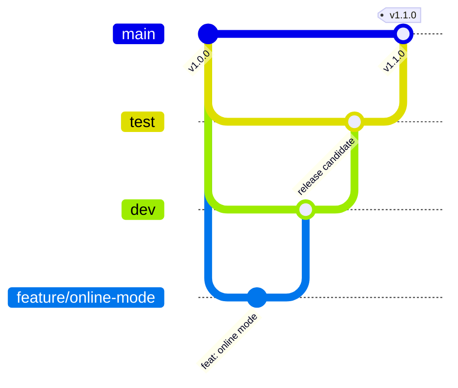

# Contributing

This guide covers how code moves from an idea to production.

## Branches

| Branch      | Purpose                                         | Deploys to     |
| ----------- | ----------------------------------------------- | -------------- |
| `main`      | What's in production. Every merge is a release. | **production** |
| `test`      | Release candidate, checked before production.   | **staging**    |
| `dev`       | Integration: finished features land here.       | —              |
| `feature/*` | One feature or fix, branched from `dev`.        | —              |
| `hotfix/*`  | Urgent production fix, branched from `main`.    | —              |

All three long-lived branches are protected: no direct pushes, and CI must
pass before a pull request can merge.



### Everyday flow

1. **Start from dev.**
   ```sh
   git switch dev && git pull
   git switch -c feature/short-description   # or fix/…, docs/…, chore/…
   ```
2. **Commit in small, logical steps** (see [commit messages](#commit-messages)).
3. **Check before pushing.**
   ```sh
   npm run check              # lint + formatting + unit tests
   npm run test:integration   # API tests (needs PostgreSQL and Redis)
   npm run test:e2e           # browser tests
   ```
4. **Open a pull request into `dev`.** Fill in the template. CI runs lint,
   unit and integration tests, and browser tests against the production
   Docker stack.
5. **Merge when CI is green.** The feature branch is deleted automatically.

### Releasing

1. On `dev`, move the **Unreleased** section of `CHANGELOG.md` under a new
   version heading and bump `version` in `package.json`
   ([Semantic Versioning](https://semver.org/): `fix` → patch, `feat` → minor,
   breaking change → major).
2. Open a PR **`dev → test`**. When it merges, the site deploys to **staging**.
   Check it there.
3. Open a PR **`test → main`**. When it merges, the site deploys to
   **production** and the `vN.N.N` tag and GitHub release are created from
   the changelog.
4. The Deploy workflow then opens and merges a PR **`main → test`**, so
   test has the release's merge commit and the next `test → main` PR is up
   to date (branch protection requires it). This needs "Allow GitHub
   Actions to create and approve pull requests" (Settings → Actions →
   General); without it the job leaves a notice, and you open that PR by
   hand.

Use **merge commits** (not squash) for `dev → test` and `test → main`, so the
three branches share the same history.

### Hotfixes

For a production bug that can't wait for the next release:

1. `git switch main && git pull && git switch -c hotfix/short-description`
2. Fix it with a test, bump the patch version, and add a changelog entry.
3. PR into `main`. After it deploys, merge `main` back into `test` and `dev`
   so the fix isn't lost.

## Commit messages

We use [Conventional Commits](https://www.conventionalcommits.org/):

```
<type>(<optional scope>): <what changed, imperative, lower case>

<why it changed and anything a reviewer should know>
```

| Type       | Use for                              |
| ---------- | ------------------------------------ |
| `feat`     | A new feature players can see        |
| `fix`      | A bug fix                            |
| `test`     | Adding or changing tests only        |
| `docs`     | Documentation only                   |
| `refactor` | Code change with no behaviour change |
| `style`    | Formatting only                      |
| `chore`    | Tooling, dependencies, housekeeping  |
| `ci`       | CI/CD workflows                      |

Example: `fix(online): keep the guest's board locked until the host replies`

## Tests

| Command            | What it runs                                                              |
| ------------------ | ------------------------------------------------------------------------- |
| `npm test`         | Unit tests (`tests/unit/`): rules, AI, room codes, message checks         |
| `npm run test:e2e` | Browser tests (`tests/e2e/`) with Playwright against the built site       |
|                    | Includes an accessibility check (axe) of the main screens, light and dark |
| `npm run check`    | Lint + formatting + unit tests, the quick pre-push check                  |

- New logic goes in a pure module (no DOM) with unit tests.
- New user-facing behaviour gets a browser test.
- Online tests are tagged `@online` and need internet access. Skip them with
  `npm run test:e2e -- --grep-invert @online`.
- First-time setup for browser tests: `npx playwright install chromium`.

## Code style

- `npm run typecheck` checks the JavaScript with TypeScript (no build
  step, no TypeScript files): misspelt properties, wrong argument counts,
  calls on the wrong type. Where it can't tell a type, a JSDoc comment says
  it. Fastify's additions are declared in `types/fastify.d.ts`.
- ESLint and Prettier are the source of truth. Run `npm run format` to fix
  formatting, `npm run lint` to catch mistakes.
- Keep the game logic (`rules.js`, `ai.js`, `room.js`, `protocol.js`) free of
  DOM code so it stays testable.
- Treat everything received over the network as untrusted and validate it in
  `protocol.js`.

## Languages

The site speaks English, French and Spanish (see
[ARCHITECTURE.md](docs/ARCHITECTURE.md#languages)). When you add or change
text players can see:

- In `index.html`, just write English: the page's text is translated
  automatically.
- In scripts, wrap it: `t('{name} is thinking…', { name })`. Put names and
  numbers in `{placeholders}`, never glue sentences together from pieces.
- Server messages stay plain English sentences: they are translated on the
  way out.
- Add the translation to `js/locales/fr.js` and `js/locales/es.js`.
  `npm test` fails and lists anything missing, stale, or with a
  `{placeholder}` that doesn't match.
